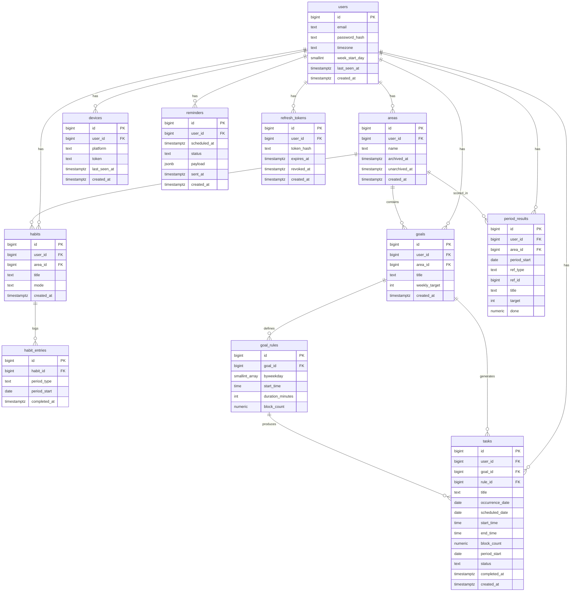

# Design — Spoons Up

Personal task and habit tracking app. Areas group what you're trying to be consistent at; habits and goals live under them; weekly results roll up to the area.

---

## Behaviour

**Auth** — email and password, JWT access tokens valid 15 minutes. Normal requests never touch the database for identity. `user_id` comes from the token and never appears in a URL; sub-resources carry their own id but queries still filter on `user_id`, so someone else's row is a 404.

**Refresh tokens** — random string valid 30 days, only its sha256 hash stored. The presented token is revoked and a new one issued on every refresh. A revoked token presented again revokes every live row for that user. The client serialises refreshes behind a single in-flight promise; the server reads the row `FOR UPDATE`.

**Session ending** — logout revokes that row, a password change revokes all of them. Login inserts a row without touching existing ones, so several devices stay signed in. Refresh tokens live in SecureStore on mobile and an httpOnly cookie on web; the access token is held in memory.

**Areas** — user-defined top-level buckets (SWE, Finance, Social). Everything tracked belongs to one. An area's weekly result is derived: every requirement under it must pass.

**Habits** — behaviours you check off. No scheduling, no duration, no moving. `DAILY` is one checkbox per day, `WEEKLY` one per week on any day. No quota, no fixed weekdays.

**Habit entries are sparse** — a row exists only when the user checks off. No row means not done; there is no MISSED or SKIPPED status. Undo is a hard delete.

**Habit mode is editable** — each entry carries its own `period_type`, so switching `DAILY` and `WEEKLY` leaves old rows readable at their original granularity.

**Daily and weekly views** — the today screen holds both. Daily shows `DAILY` habits with the day's tasks underneath, ordered by start time; weekly shows `WEEKLY` habits alone. One endpoint returns all three lists. Quota progress lives in the area view.

**Goals** — weekly quotas ("3 CS Blocks a week"), user-entered. `weekly_target` is a whole number of blocks and is nullable for goals scheduled ad hoc. A goal's weekly `done` is `SUM(block_count)` across its completed tasks, not the number of task rows. Blocks can be halved, so `done` can be 2.5 against a target of 3.

**Goal rules** — a goal can have several at once: `{Mon, Wed, Fri} 19:00, 60min` alongside `{Mon, Tue} 07:00, 60min`. `block_count` says how many blocks each generated task contributes and is copied to that task. Weekdays are pre-fill, not a contract — once a task exists the rule stops binding it.

**Changing a rule redraws the open week** — tasks that rule produced are removed and generated again from the open week forward. Removed means untouched ones only: `DONE` tasks stay, and so do tasks the user moved (`scheduled_date` differs from `occurrence_date`), because those were the user's decisions. Closed weeks are never touched. The week's quota is a count, not a set of days, so a task done on Monday still counts after the rule moves the rest to Sunday.

**Tasks** — concrete scheduled work with a start time and duration. `block_count` is a separate user-entered counter value; it is not derived from duration. It moves in steps of 0.5 — half a block is the smallest unit — and the client offers 0.5, 1, 2 and 4. Changing one task's `block_count` changes only that task, not its rule. A task belongs to a goal, or stands alone (dentist appointment).

**Task generation** — `add_tasks(user_id, from, to)` expands a user's rules into task rows for a date range and writes each task's reminder with it. Reads never generate; a task is on screen because a write or the daily job put it there. Idempotent through `INSERT ... ON CONFLICT DO NOTHING` on `(goal_id, rule_id, occurrence_date)`, so no bookkeeping table is needed.

**Two triggers, no lazy reads** — a write that creates or changes a goal or a rule adds its own tasks in the same request, so a goal saved now has today's task and reminder before the response returns. A daily job then advances a rolling window of 14 days, in each user's own timezone, so tasks and reminders exist without the app being opened. Nothing else calls `add_tasks`.

**Dormant users are skipped** — the daily job only runs for users seen recently; `users.last_seen_at` is refreshed on each authenticated request. Someone away for months has no window being written for them. Their first request back adds the window before anything is read, so they see a full calendar immediately and nothing was generated in the meantime.

**Generated window** — the calendar is generated 14 days ahead. Further out it is empty until the window reaches it.

**Occurrence identity** — `occurrence_date` records the date a rule produced and never changes. `scheduled_date` is where the user actually put it.

**Postpone** — `scheduled_date` moves; `occurrence_date` and `period_start` stay fixed, so a task dragged to next Monday still counts toward the week it belonged to.

**Delete** — when the user deletes a task, a rule-generated one soft deletes (`status = DELETED`) so generation doesn't bring it back, and an ad-hoc one hard deletes. Removals the system does itself — a rule change, an area archive — are hard deletes, so the same occurrence can be generated again later.

**Extra tasks** — the user can add beyond the rule (`rule_id` and `occurrence_date` NULL). Outside the unique index, so unlimited; still counts toward the week's quota through `period_start`.

**Catch-up on return** — nothing to catch up. The daily job runs whether or not the app is opened, so a user away for five weeks comes back to five weeks of generated tasks: past weeks show what was missed, the current week is live.

**Frozen history** — when a week closes, each requirement's `target` and `done` are snapshotted to `period_results`. The scheduled job writes it at the week turn in the user's own timezone; reads never write.

**Weekly target follows active days** — a requirement is judged only on the days it was actually active that week. A `DAILY` habit's target is the number of days between `max(week_start, created_at, area.unarchived_at)` and `min(week_end, area.archived_at)`, so a habit added on Wednesday needs 5 of 5, not 7 of 7. `WEEKLY` habits stay 1 as long as one day was active. A requirement with no active day in a week gets no `period_results` row, the week reads empty for it, and the client draws those days as neither done nor missed. The area's two timestamps cannot express more than one archive cycle inside a week; the last one wins.

**Live current week** — the open week is computed from raw rows, so changing a quota mid-week takes effect immediately.

**Only areas archive** — an area is a long-running commitment worth putting down and picking up, so it has `archived_at` and `unarchived_at`. Habits and goals don't: a habit is either tracked or dropped, and dropping one usually means replacing it. They have delete and nothing else.

**Archiving an area touches only the area row** — its habits, goals and rules are untouched; they simply stop being reachable while the area is archived, so restoring brings them all back as they were. Archiving removes the area's future pending tasks and their reminders; restoring does not bring them back, and generation resumes from today forward.

**Delete is hard everywhere** — deleting a habit removes its entries, deleting a goal removes its rules, tasks and reminders, deleting an area removes everything under it. `period_results` rows are never deleted: they carry a snapshotted `title` and a `ref_id` that is not a foreign key, so past weeks keep reading after the thing they describe is gone. What is lost is the detail below the week — a deleted habit's day squares, a deleted goal's blocks on old calendars.

**Areas delete from either state** — an active area can be deleted without archiving it first. The client confirms with a strong warning that the area's habits, goals and all of their history go with it, and points to archive as the reversible way to put an area down.

**Push notifications** — a reminder five minutes before a task starts. A `reminders` row is written at task creation with `scheduled_at` in UTC, updated on move, cancelled on delete. A scheduler scans due reminders every minute and pushes to registered tokens through FCM/APNs.

**Multi-device push** — a reminder fans out to every registered device. Invalid tokens are pruned on delivery failure.

**Timezone-correct everywhere** — `scheduled_date` and `start_time` are stored local; `users.timezone` holds an IANA name so DST is handled. The worker derives each user's today from their own timezone. Reminder times are converted to UTC once, at write time.

**Configurable week start** — `users.week_start_day` decides where the week boundary falls, and `period_start` is computed from it rather than assuming ISO Monday.

---

## Open questions

**Goals active for part of a week** — a `DAILY` habit's target can be derived from active days, but a goal's `weekly_target` is a number the user chose, so scaling it is arbitrary. Options: keep the full target, or let the user set a target for the open week only ("2 this week", or 0 to skip it). Decide in slice 5.

**Regenerating into days already past** — when a rule changes mid-week, the new weekdays may fall before today. Options: generate them anyway so the user can still tick them off, or generate from today forward and let the week run short. Decide in slice 3.

**week\_start\_day changed mid-week** — tasks already generated carry a `period_start` computed from the old boundary. After the change the open week's quota looks at a different range and stops matching them. Options: apply the change from the next week, recompute `period_start` for the open week's tasks, or only allow the change at a week boundary. Decide in slice 3.

---

## Schema

### ER Diagram



### Tables

#### users

| column | type | note |
|---|---|---|
| id | bigint | PK |
| email | text | unique |
| password_hash | text | |
| timezone | text | IANA, e.g. Europe/Istanbul |
| week_start_day | smallint | 1 = Monday |
| last_seen_at | timestamptz | refreshed on each authenticated request; the daily job skips users who have been away |
| created_at | timestamptz | |

#### refresh_tokens

| column | type | note |
|---|---|---|
| id | bigint | PK |
| user_id | bigint | FK -> users |
| token_hash | text | unique, sha256 of the token |
| expires_at | timestamptz | issued_at + 30 days |
| revoked_at | timestamptz | nullable |
| created_at | timestamptz | |

```sql
CREATE INDEX ON refresh_tokens (user_id) WHERE revoked_at IS NULL;
```

#### areas

| column | type | note |
|---|---|---|
| id | bigint | PK |
| user_id | bigint | FK -> users |
| name | text | |
| archived_at | timestamptz | nullable |
| unarchived_at | timestamptz | nullable, when the area last came back from the archive |
| created_at | timestamptz | |

#### habits

| column | type | note |
|---|---|---|
| id | bigint | PK |
| user_id | bigint | FK -> users |
| area_id | bigint | FK -> areas |
| title | text | |
| mode | text | DAILY \| WEEKLY |
| created_at | timestamptz | |

#### habit_entries

| column | type | note |
|---|---|---|
| id | bigint | PK |
| habit_id | bigint | FK -> habits |
| period_type | text | DAY \| WEEK |
| period_start | date | first day of the week when WEEK |
| completed_at | timestamptz | |

```sql
UNIQUE (habit_id, period_type, period_start)
```

#### goals

| column | type | note |
|---|---|---|
| id | bigint | PK |
| user_id | bigint | FK -> users |
| area_id | bigint | FK -> areas |
| title | text | |
| weekly_target | int | nullable, number of blocks |
| created_at | timestamptz | |

#### goal_rules

| column | type | note |
|---|---|---|
| id | bigint | PK |
| goal_id | bigint | FK -> goals |
| byweekday | smallint[] | e.g. {1,3,5} |
| start_time | time | |
| duration_minutes | int | |
| block_count | numeric(3,1) | default 1, positive multiple of 0.5, copied to each generated task |

#### tasks

| column | type | note |
|---|---|---|
| id | bigint | PK |
| user_id | bigint | FK -> users |
| goal_id | bigint | FK -> goals, nullable |
| rule_id | bigint | FK -> goal_rules, nullable |
| title | text | |
| occurrence_date | date | nullable, the date the rule produced |
| scheduled_date | date | |
| start_time | time | |
| end_time | time | start_time + duration_minutes |
| block_count | numeric(3,1) | default 1, positive multiple of 0.5; contribution to the goal's weekly target |
| period_start | date | which week the quota counts toward |
| status | text | PENDING \| DONE \| DELETED |
| completed_at | timestamptz | nullable |
| created_at | timestamptz | |

```sql
CREATE UNIQUE INDEX ON tasks (goal_id, rule_id, occurrence_date)
WHERE occurrence_date IS NOT NULL;
```

`block_count` does not change occurrence identity: a two-block occurrence is still one task row. Separate times on the same day still require separate rules.

`goal_rules.block_count` and `tasks.block_count` both carry the same check, so half blocks are allowed and anything finer is rejected:

```sql
CHECK (block_count > 0 AND block_count * 2 = trunc(block_count * 2))
```

#### period_results

| column | type | note |
|---|---|---|
| id | bigint | PK |
| user_id | bigint | FK -> users |
| area_id | bigint | FK -> areas |
| period_start | date | |
| ref_type | text | HABIT \| GOAL |
| ref_id | bigint | habits.id or goals.id — not a foreign key |
| title | text | snapshot of the habit or goal title |
| target | int | |
| done | numeric(5,1) | goal rows snapshot `SUM(tasks.block_count)` for completed tasks, so it can be fractional |

```sql
UNIQUE (ref_type, ref_id, period_start)
```

#### reminders

| column | type | note |
|---|---|---|
| id | bigint | PK |
| user_id | bigint | FK -> users |
| scheduled_at | timestamptz | UTC, when to send |
| status | text | PENDING \| SENT \| CANCELLED |
| payload | jsonb | title, body, deep link, ref |
| sent_at | timestamptz | nullable |
| created_at | timestamptz | |

```sql
CREATE INDEX ON reminders (scheduled_at) WHERE status = 'PENDING';
```

#### devices

| column | type | note |
|---|---|---|
| id | bigint | PK |
| user_id | bigint | FK -> users |
| platform | text | IOS \| ANDROID \| WEB |
| token | text | FCM / APNs device token |
| last_seen_at | timestamptz | updated on every device registration |
| created_at | timestamptz | |
