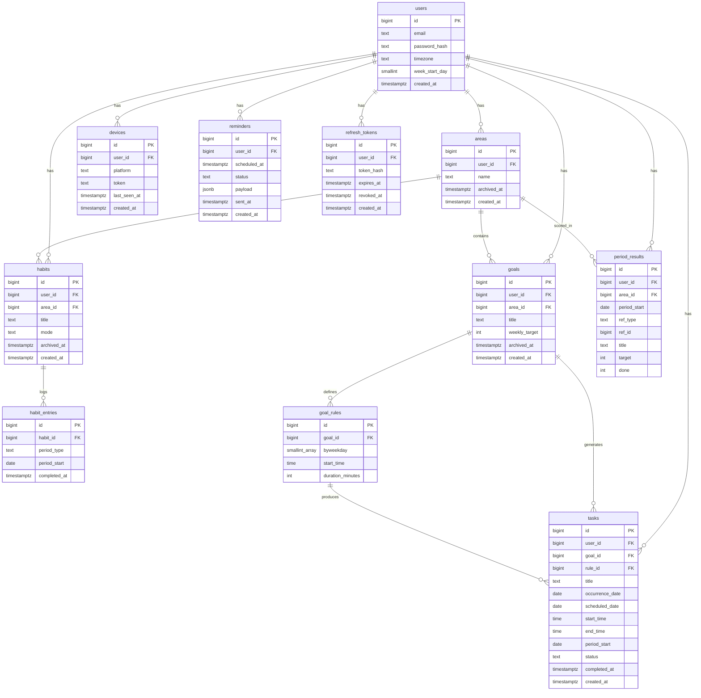

# Design — Spoons Up

Personal task and habit tracking app. Areas group what you're trying to be consistent at; habits and goals live under them; weekly results roll up to the area.

---

## Behaviour

**Auth** — email and password, JWT access tokens valid 15 minutes. Normal requests never touch the database for identity. `user_id` comes from the token and never appears in a URL; sub-resources carry their own id but queries still filter on `user_id`, so someone else's row is a 404.

**Refresh tokens** — random string valid 30 days, only its sha256 hash stored. The presented token is revoked and a new one issued on every refresh. A revoked token presented again revokes every live row for that user. The client serialises refreshes behind a single in-flight promise; the server reads the row `FOR UPDATE`.

**Session ending** — logout revokes that row, a password change revokes all of them. Login inserts a row without touching existing ones, so several devices stay signed in. Refresh tokens live in SecureStore on mobile and an httpOnly cookie on web; the access token is held in memory.

**Areas** — user-defined top-level buckets (SWE, Finance, Social). Everything tracked belongs to one. An area's weekly result is derived: every requirement under it must pass.

**Habits** — behaviours you check off. No scheduling, no duration, no moving. `DAILY` is one checkbox per day, `WEEKLY` one per week on any day. No quota, no fixed weekdays.

**Habit entries are sparse** — a row exists only when the user checks off. No row means not done; there is no MISSED or SKIPPED status. Undo is a hard delete.

**Habit mode is editable** — each entry carries its own `period_type`, so switching `DAILY` and `WEEKLY` leaves old rows readable at their original granularity.

**Daily and weekly views** — the today screen holds both. Daily shows `DAILY` habits with the day's tasks underneath, ordered by start time; weekly shows `WEEKLY` habits alone. One endpoint returns all three lists. Quota progress lives in the area view.

**Goals** — weekly quotas ("3 CS Blocks a week"), user-entered. `weekly_target` is nullable for goals scheduled ad hoc.

**Goal rules** — a goal can have several at once: `{Mon, Wed, Fri} 19:00, 60min` alongside `{Mon, Tue} 07:00, 60min`. Weekdays are pre-fill, not a contract — once a task exists the rule stops binding it.

**Tasks** — concrete scheduled work with a start time and duration. Belongs to a goal, or stands alone (dentist appointment).

**Lazy task generation** — tasks for a week are created the first time that week is requested. Idempotent through `INSERT ... ON CONFLICT DO NOTHING`; the check is whether a `(rule_id, period_start)` row exists, so no bookkeeping table is needed.

**Background materialization** — a worker also materializes the next 24 hours every 5-15 minutes so notifications work for users who haven't opened the app. Same `materialize(user_id, from, to)` function, different trigger.

**Occurrence identity** — `occurrence_date` records the date a rule produced and never changes. `scheduled_date` is where the user actually put it.

**Postpone** — `scheduled_date` moves; `occurrence_date` and `period_start` stay fixed, so a task dragged to next Monday still counts toward the week it belonged to.

**Delete** — rule-generated tasks soft delete (`status = DELETED`); ad-hoc tasks hard delete.

**Extra tasks** — the user can add beyond the rule (`rule_id` and `occurrence_date` NULL). Outside the unique index, so unlimited; still counts toward the week's quota through `period_start`.

**Catch-up on return** — a user away for five weeks sees all of it: every missing week is materialized, past weeks show what was missed, the current week is live. Bounded to roughly 12 weeks back.

**Frozen history** — when a week closes, each requirement's `target` and `done` are snapshotted to `period_results`.

**Live current week** — the open week is computed from raw rows, so changing a quota mid-week takes effect immediately.

**Archive vs delete** — archiving stops generation and hides from active lists while keeping history; `archived_at` is a timestamp, so past weeks know whether the item existed then. Deleting removes everything, including past results.

**Push notifications** — a reminder five minutes before a task starts. A `reminders` row is written at task creation with `scheduled_at` in UTC, updated on move, cancelled on delete. A scheduler scans due reminders every minute and pushes to registered tokens through FCM/APNs.

**Multi-device push** — a reminder fans out to every registered device. Invalid tokens are pruned on delivery failure.

**Timezone-correct everywhere** — `scheduled_date` and `start_time` are stored local; `users.timezone` holds an IANA name so DST is handled. The worker derives each user's today from their own timezone. Reminder times are converted to UTC once, at write time.

**Configurable week start** — `users.week_start_day` decides where the week boundary falls, and `period_start` is computed from it rather than assuming ISO Monday.

---

## Open questions

**week\_start\_day changed mid-week** — tasks already generated carry a `period_start` computed from the old boundary. After the change the open week's quota looks at a different range and stops matching them. Options: apply the change from the next week, recompute `period_start` for the open week's tasks, or only allow the change at a week boundary. Decide in slice 3.

---

## Schema

### ER Diagram



### Tables

#### users

| column | type | note |
|---|---|---|
| id | bigint | PK |
| email | text | unique |
| password_hash | text | |
| timezone | text | IANA, e.g. Europe/Istanbul |
| week_start_day | smallint | 1 = Monday |
| created_at | timestamptz | |

#### refresh_tokens

| column | type | note |
|---|---|---|
| id | bigint | PK |
| user_id | bigint | FK -> users |
| token_hash | text | unique, sha256 of the token |
| expires_at | timestamptz | issued_at + 30 days |
| revoked_at | timestamptz | nullable |
| created_at | timestamptz | |

```sql
CREATE INDEX ON refresh_tokens (user_id) WHERE revoked_at IS NULL;
```

#### areas

| column | type | note |
|---|---|---|
| id | bigint | PK |
| user_id | bigint | FK -> users |
| name | text | |
| archived_at | timestamptz | nullable |
| created_at | timestamptz | |

#### habits

| column | type | note |
|---|---|---|
| id | bigint | PK |
| user_id | bigint | FK -> users |
| area_id | bigint | FK -> areas |
| title | text | |
| mode | text | DAILY \| WEEKLY |
| archived_at | timestamptz | nullable |
| created_at | timestamptz | |

#### habit_entries

| column | type | note |
|---|---|---|
| id | bigint | PK |
| habit_id | bigint | FK -> habits |
| period_type | text | DAY \| WEEK |
| period_start | date | first day of the week when WEEK |
| completed_at | timestamptz | |

```sql
UNIQUE (habit_id, period_type, period_start)
```

#### goals

| column | type | note |
|---|---|---|
| id | bigint | PK |
| user_id | bigint | FK -> users |
| area_id | bigint | FK -> areas |
| title | text | |
| weekly_target | int | nullable |
| archived_at | timestamptz | nullable |
| created_at | timestamptz | |

#### goal_rules

| column | type | note |
|---|---|---|
| id | bigint | PK |
| goal_id | bigint | FK -> goals |
| byweekday | smallint[] | e.g. {1,3,5} |
| start_time | time | |
| duration_minutes | int | |

#### tasks

| column | type | note |
|---|---|---|
| id | bigint | PK |
| user_id | bigint | FK -> users |
| goal_id | bigint | FK -> goals, nullable |
| rule_id | bigint | FK -> goal_rules, nullable |
| title | text | |
| occurrence_date | date | nullable, the date the rule produced |
| scheduled_date | date | |
| start_time | time | |
| end_time | time | start_time + duration_minutes |
| period_start | date | which week the quota counts toward |
| status | text | PENDING \| DONE \| DELETED |
| completed_at | timestamptz | nullable |
| created_at | timestamptz | |

```sql
CREATE UNIQUE INDEX ON tasks (goal_id, rule_id, occurrence_date)
WHERE occurrence_date IS NOT NULL;
```

#### period_results

| column | type | note |
|---|---|---|
| id | bigint | PK |
| user_id | bigint | FK -> users |
| area_id | bigint | FK -> areas |
| period_start | date | |
| ref_type | text | HABIT \| GOAL |
| ref_id | bigint | habits.id or goals.id — not a foreign key |
| title | text | snapshot of the habit or goal title |
| target | int | |
| done | int | |

```sql
UNIQUE (ref_type, ref_id, period_start)
```

#### reminders

| column | type | note |
|---|---|---|
| id | bigint | PK |
| user_id | bigint | FK -> users |
| scheduled_at | timestamptz | UTC, when to send |
| status | text | PENDING \| SENT \| CANCELLED |
| payload | jsonb | title, body, deep link, ref |
| sent_at | timestamptz | nullable |
| created_at | timestamptz | |

```sql
CREATE INDEX ON reminders (scheduled_at) WHERE status = 'PENDING';
```

#### devices

| column | type | note |
|---|---|---|
| id | bigint | PK |
| user_id | bigint | FK -> users |
| platform | text | IOS \| ANDROID \| WEB |
| token | text | FCM / APNs device token |
| last_seen_at | timestamptz | updated on every device registration |
| created_at | timestamptz | |
