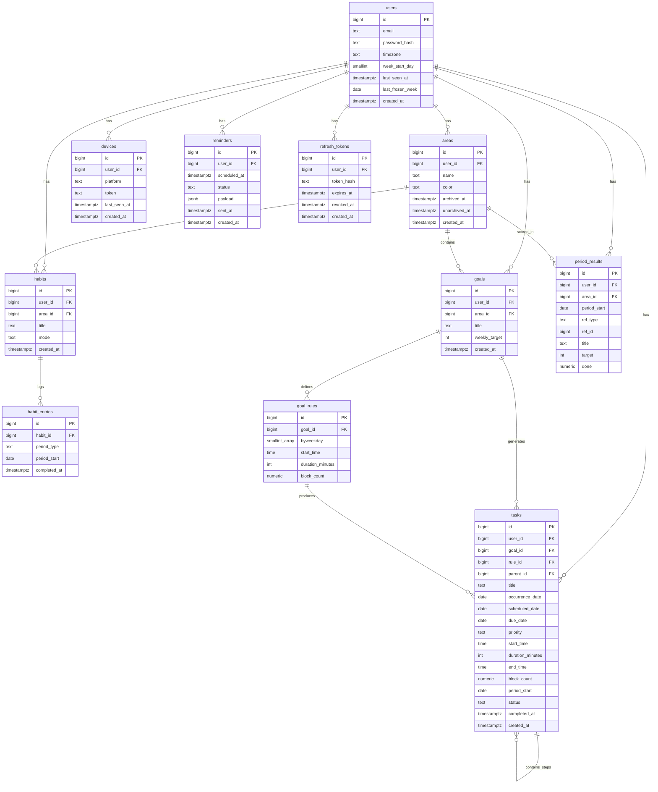

# Design — Spoons Up

Personal task and habit tracking app. Areas group what you're trying to be consistent at; habits and goals live under them; weekly results roll up to the area. Journal holds goal-less work independently of areas.

---

## Behaviour

**Auth** — email and password, JWT access tokens valid 15 minutes. Identity comes from the token; authenticated requests touch the user row only to refresh `last_seen_at` and, after a dormant period, restore the generated task window. `user_id` never appears in a URL; sub-resources carry their own id but queries still filter on `user_id`, so someone else's row is a 404.

**Refresh tokens** — random string valid 30 days, only its sha256 hash stored. The presented token is revoked and a new one issued on every refresh. A revoked token presented again revokes every live row for that user. The client serialises refreshes behind a single in-flight promise; the server reads the row `FOR UPDATE`.

**Session ending** — logout revokes that row, a password change revokes all of them. Login inserts a row without touching existing ones, so several devices stay signed in. Refresh tokens live in SecureStore on mobile and an httpOnly cookie on web; the access token is held in memory.

**Registration gate** — registration is enabled by default for local development and the first production signup. Production turns `REGISTRATION_ENABLED` off after the owner account exists. While it is off, `POST /auth/register` returns `403 registration_closed`; existing users can still log in, refresh and log out.

**Login throttling** — login attempts are reserved by normalised email in process memory before the password hash is checked, so parallel requests cannot all pass the limit check. The first five attempts inside 15 minutes may perform password verification and failed ones keep the same `invalid_credentials` response; after the fifth reservation, every later attempt for that email is refused for 15 minutes with `429 too_many_attempts`, even when the password is correct. A successful login among the first five clears the count. Other emails are independent. A process restart clears the counters, and production runs one API process, so no distributed rate-limit store is needed for this single-user deployment.

**Deployment topology** — production uses a static Vite build on Vercel, the FastAPI Docker image on Render and Supabase's SSL Session pooler for Postgres only. The browser calls relative `/api/v1` URLs; Vercel rewrites `/api/:path*` to Render, so the refresh cookie remains first-party. The cookie has no fixed `Domain` and is `Secure` in production. Render configuration comes from environment variables and contains no localhost fallback. Supabase Auth, API and Storage are not used.

**Production operations** — `GET /health` is unauthenticated, does not acquire a database session and is excluded from OpenAPI. `POST /internal/jobs/hourly` is also excluded from OpenAPI and accepts only an `X-Cron-Secret` value that matches `CRON_SECRET` using a constant-time comparison. cron-job.org calls Render directly: health every 10 minutes and the hourly job every hour. The Vercel rewrite is not part of either operational path.

**Areas** — user-defined top-level buckets (SWE, Finance, Social). Habits and goals belong to one; Journal tasks sit outside them. An area's weekly progress is derived from the requirements under it; see **Weekly progress**.

**Area colours** — each area gets a colour from an eight-colour palette when it is created, at random among the colours the user's areas use least, so areas stay apart until the palette runs out. Its goals, habits and tasks are drawn in that colour; Journal tasks keep the accent. Goals and habits tell apart by shape and weight instead: a goal is a square with a solid fill, a habit a circle with a light fill and an outline. On Today a habit row is outlined and lightly striped in its area colour, where a goal task card has a flat tint. Progress bars and day squares keep the accent.

**Habits** — behaviours you check off. No scheduling, no duration, no moving. `DAILY` is one checkbox per day, `WEEKLY` one per week on any day. No quota, no fixed weekdays.

**Habit entries are sparse** — a row exists only when the user checks off. No row means not done; there is no MISSED or SKIPPED status. Undo is a hard delete.

**Habit mode is editable** — each entry carries its own `period_type`, so switching `DAILY` and `WEEKLY` leaves old rows readable at their original granularity.

**Daily, weekly and left-behind views** — the today screen holds all three. Daily shows the day's timed tasks ordered by start time, then untimed tasks, above the `DAILY` habits; weekly shows `WEEKLY` habits alone. Left behind shows unfinished scheduled work from earlier days and is hidden when empty. One endpoint returns all three views' data. Quota progress lives in the area view.

**Goals** — weekly quotas ("3 CS Blocks a week"), user-entered. `weekly_target` is a whole number of blocks and is nullable for goals scheduled ad hoc. A goal's weekly `done` is `COALESCE(SUM(block_count), 0)` across its completed tasks, not the number of task rows. A null block value contributes zero; non-null blocks can be halved, so `done` can be 2.5 against a target of 3.

**Goal rules** — schedules shown under a goal. A goal starts without one and can hold several. Weekdays are required; start time, duration and `block_count` are optional templates copied to generated tasks. Weekdays are pre-fill, not a contract — once a task exists the rule stops binding it.

**Changing a rule redraws unfinished work** — untouched `PENDING` tasks that rule produced are removed from the open week forward, including days before today. `DONE` tasks stay, and so do tasks the user moved (`scheduled_date` differs from `occurrence_date`), because those were the user's decisions. New tasks are generated from today forward only, so newly selected weekdays earlier in the open week stay empty. Closed weeks are never touched. The week's quota is a count, not a set of days, so a task done on Monday still counts after the rule moves the rest to Sunday.

**Tasks** — concrete work that may or may not currently sit on a local date. Start time, duration and `block_count` are independent and optional; `end_time` exists only when both time and duration exist. A non-null block value moves in steps of 0.5 and is not derived from duration. Changing one task changes only that task, not its rule. Goal tasks have `goal_id` set, always have a `scheduled_date`, and take their title from the goal. Journal tasks have no goal and keep their user-entered title. Renaming a goal renames all of its tasks, done ones included; closed weeks keep the old title in `period_results`.

**Journal** — every goal-less task is a Journal task, wherever it was created. Journal uses the existing `tasks` table; there is no Journal entity, `in_journal` flag or second task table. The Journal page shows open top-level Journal items and completed top-level items with their steps. It is one ungrouped list: active items with a due date come first by date, time and creation order, followed by undated items in creation order. That due-date order is the default; the active list can instead be sorted by date added, newest first, or by priority — High, Medium, Low, then none — with ties kept in the default order. The choice is not remembered between visits. Completed items are always newest-completed first. A row has a checkbox, title, due date and time when present, and a progress bar and fraction when it has steps. The displayed date is `due_date`, never the possibly different `scheduled_date`; an overdue due date is red but does not otherwise change the item. Completed rows show their completion date instead. A top-level item can carry an optional priority — High, Medium or Low — shown as a red, amber or green tag in its own column at the end of the row, after the due date; the column appears only while a row in the list has a priority, and steps and goal tasks never have one. The page has Active and Completed counts, a new-item action, and one detail component for viewing, editing and creating an item. The detail owns title, optional due date and time, optional priority, the step checklist with inline add and remove actions, Complete or Reopen, and Delete. Title, due date, time and priority are saved together with Save, or discarded; steps, completion and deletion are written as they happen, and a step that fails to save stays in the detail to retry. Areas, area progress and Growth do not include Journal work.

**Journal dates** — `due_date` is an optional deadline or event date set only from the Journal. Setting or changing it also puts the item on that same `scheduled_date`; clearing it removes the item from its day. Planning actions in Today and Week change only `scheduled_date` and never change `due_date`. The time shown beside a due date is the task's `start_time`, not a separate due time, and is available in the Journal only while a due date is set. A task can therefore be due later but planned for today. `period_start` is derived when an unscheduled task is first put on a day, stays fixed while it is moved, and becomes null again when it is unscheduled. Journal blocks remain optional and count toward no quota.

**Journal steps** — a step is a Journal task whose `parent_id` points to a goal-less top-level task. Nesting is one level only. Steps are created in the Journal with a title and no date, time, duration or blocks; they receive planning values only when put on a day. They never have a `due_date`. Progress is completed steps over all steps. A top-level item with steps is not selectable for ad-hoc planning from the Journal picker; its open steps are selected individually. Its own calendar day, when any, comes from its due date.

**Completing Journal work** — checking a Journal task anywhere marks the same task `DONE`. A completed top-level item leaves the active Journal list but stays checked on any day where it is scheduled. Completing every step does not complete its item. Completing a top-level item with open steps first asks, with the actual count, “2 steps are not complete. Finish anyway?” Confirmation leaves those steps pending but clears their schedule, period and time so they leave Today, Week and Left behind. Reopening the item does not restore the cleared plans. Deleting a top-level item hard-deletes it and cascades to its steps.

**Goal and Journal entry** — goals are created under areas and start without a schedule. Repeat reveals one or more schedules. Today and Week use two separate task components rather than a shared `No goal` choice. `+ Goal` requires an `Area - Goal`, takes its title from that goal and retains Repeat. `+ Journal` can create a titled Journal task or select an existing open item without steps; an item with steps drills into only its open steps. There is no search and no `New / Journal` tab. Time, duration and blocks belong to the plan section. Today fixes the date to today; Week allows today or later with no upper bound. A task already on a day is edited in one form for both kinds, the way goal tasks always were: a goal task shows its goal and Repeat, a Journal task its title, and both change date, time, duration and blocks or delete the task.

Task fields follow the screen that owns the decision:

| Screen | Date | Time | Duration | Blocks |
|---|---|---|---|---|
| Journal, new item or item detail | optional due date | optional only with a due date | no | no |
| Journal, new step | no | no | no | no |
| Today, Goal or Journal plan | today, fixed | optional | optional | optional |
| Week, Goal or Journal plan | today or later | optional | optional | optional |

Duration and blocks are assigned only while planning work onto a day. A Journal block is a size indicator and never contributes to an area quota. There is no progress slider, continue-tomorrow action or remove-from-plan action in this slice.

**Today Journal entry** — the Today header has separate `+ Goal` and `+ Journal` actions. The Journal picker starts with `+ New task`, then shows the first five rows ordered overdue, dated and undated, with `Show all (N)` when more exist. Choosing an existing item or step updates that task instead of creating another row. Steps render as normal full-width task cards ordered with everything else; a step card carries its parent's title and step progress as secondary text.

**Journal exclusions** — the Journal list has no overdue/today/upcoming groups, progress slider, continue-tomorrow action, search or undo toast; a checked item moves to Completed and is reopened there. Planning has no leave-in-Journal or remove-from-plan action. Goal and Journal creation do not become tabs inside one shared form. Completing a parent never auto-completes its open steps.

**Left behind** — Today adds a third view after Daily and Weekly, visible only when it has rows. It contains every pending goal-less task whose `scheduled_date` is before today, with no age limit, plus pending goal tasks from earlier days of the current open week whose `period_start` is that open week. Rows are oldest first and show their original date and time, `Journal` or the goal's area as their source, and only `Move to today`. Moving changes `scheduled_date` alone; a goal task keeps its original `period_start`. Journal work can appear both here and in the Journal picker.

**Week scope and task entry** — Week has only two destinations: the user's current week and the following week. It never navigates into a past week or beyond the following week. Clicking a today-or-future calendar slot or the header add action first asks for Goal or Journal, then opens the corresponding component with the proposed date and time. Elapsed slots remain visible and their pending tasks can be moved to today or later, but they are not creation or drop targets. A task with no `scheduled_date` never appears.

**Tasks beyond Week** — manually placed tasks after the end of next week remain visible even though the calendar cannot navigate there. `GET /week` returns their count and complete task list. A Journal item whose due date schedules it after next week is included. Choosing a later task opens it in that edit form; creating work no longer offers the shared `No goal` choice from earlier slices. Ad-hoc tasks and moved rule occurrences are included; untouched generated occurrences are not.

**Repeat from a task** — Repeat is available only in the Goal component. With Repeat off it creates an ad-hoc goal task; with it on it creates a rule and lets that rule generate the occurrences. The form shows only the rule's weekdays because time, duration and blocks already sit in the task fields. Editing the task never edits the rule; editing its schedule patches the linked rule and uses the existing regeneration behaviour.

**Repeat on and off while editing** — turning Repeat on for an ad-hoc goal task creates a rule from the task's time, duration and blocks, and the task becomes that rule's occurrence on its current date, so generation never adds a second task there. The chosen weekdays must include the task's own weekday. Turning Repeat off on a repeating task ends its schedule: the task is kept as an ad-hoc task, and the rule is deleted exactly as a rule delete does, taking its untouched pending tasks from the open week forward. These two conversions are the only writes that change a task's `occurrence_date`; while a task belongs to a rule it never changes.

**Task generation** — `add_tasks(user_id, from, to)` expands a user's rules into task rows for a date range, copying nullable schedule values, and writes a reminder only for a timed task. Reads never generate; a task is on screen because a write or the daily job put it there. Idempotent through `INSERT ... ON CONFLICT DO NOTHING` on `(goal_id, rule_id, occurrence_date)`, so no bookkeeping table is needed.

**Two triggers, no lazy reads** — a write that creates or changes a rule adds its current-window tasks in the same request, including timed reminders where applicable. The hourly maintenance job advances a rolling window of 14 days using each user's own timezone, so tasks can exist without the app being opened. Locally the Compose scheduler invokes it through system cron; in production cron-job.org calls `POST /internal/jobs/hourly`. Both entrypoints call the same idempotent job function. Nothing else calls `add_tasks`.

**Dormant users are skipped** — the daily job only runs for users seen in the last 30 days; `users.last_seen_at` is refreshed on each authenticated request. Someone away longer has no window being written for them. Their first request back adds the window before anything is read, so they see a full calendar immediately and nothing was generated in the meantime.

**Generated window** — rule occurrences are generated 14 days ahead; rules do not populate dates beyond that window until it advances. Manually created tasks and tasks the user moves have no upper date limit, so they can exist later and appear in Week's `later_tasks` summary.

**Occurrence identity** — `occurrence_date` records the date a rule produced and never changes while the task belongs to that rule; only Repeat on and off while editing set or clear it. `scheduled_date` is where the user actually put it.

**Postpone** — `scheduled_date` moves; `occurrence_date` and `period_start` stay fixed, so a task dragged to next Monday still counts toward the week it belonged to.

**No scheduling in the past** — a non-null `scheduled_date` is compared with today in the user's timezone. `POST /tasks`, a `PATCH /tasks/{id}` that supplies it, and a due-date write that derives it reject an earlier date with `422 validation_error`; future dates have no upper bound. An existing item becomes overdue naturally as time passes.

**Delete** — when the user deletes a task, a rule-generated one soft deletes (`status = DELETED`) so generation doesn't bring it back, and an ad-hoc goal task or Journal task hard deletes. Deleting a top-level Journal item cascades to its steps. Removals the system does itself — a rule change, an area archive — are hard deletes, so the same occurrence can be generated again later.

**Extra tasks** — the user can add goal work beyond a rule (`rule_id` and `occurrence_date` NULL), and can add unlimited Journal work outside goals. Both sit outside the generated-task unique index. An ad-hoc goal task contributes its non-null `block_count` through `period_start`; Journal work has no goal quota.

**Catch-up on return** — past dormant time is not generated. The first authenticated request after more than 30 days restores only the current 14-day window; older empty dates stay empty.

**Frozen history** — when a week closes, each requirement's `target` and `done` are snapshotted to `period_results`. The scheduled job writes it at the week turn in the user's own timezone, and a closed week it missed is written on its next run; a user's first run reaches back to their signup week. Each week is frozen once, tracked by `users.last_frozen_week`; reads never write.

**Weekly target follows active days** — a requirement is judged only on the days it was actually active that week. A `DAILY` habit's target is the number of days between `max(week_start, created_at, area.unarchived_at)` and `min(week_end, area.archived_at)`, so a habit added on Wednesday needs 5 of 5, not 7 of 7. `WEEKLY` habits stay 1 as long as one day was active. Goals keep their full `weekly_target` even when active for only part of a week, and goals with no `weekly_target` are not requirements. A requirement with no active day in a week gets no `period_results` row and the week reads empty for it. The area's two timestamps cannot express more than one archive cycle inside a week; the last one wins.

**Live current week** — the open week is computed from raw rows, so changing a quota mid-week takes effect immediately.

**Weekly progress** — every requirement in an area counts equally toward the area's percent. A goal contributes its done blocks over `weekly_target`, a `DAILY` habit its checked days over its active days, and a `WEEKLY` habit 1 or 0; each is capped at 100%. The area's percent is the average of its requirements, and a week's percent is the average of its areas. There is no pass or fail: requirements that reach their target are shown as met counts, such as goals 2/3.

**Day squares** — each area shows its week as seven squares. A day is done when the area had at least one `DAILY` habit active that day and every one of them was checked. Goals and `WEEKLY` habits do not affect the squares. Squares are read from habit entries, for closed weeks too, so a deleted habit's squares go with it.

**Progress and Growth** — the Areas screen and Today's week panel show the open week, computed live. Growth shows closed weeks from `period_results`, newest first, 12 at a time, back to the signup week. Both use the same per-area shape and calculation; they differ only in the week they read and where it comes from.

**Only areas archive** — an area is a long-running commitment worth putting down and picking up, so it has `archived_at` and `unarchived_at`. Habits and goals don't: a habit is either tracked or dropped, and dropping one usually means replacing it. They have delete and nothing else.

**Archiving an area touches only the area row** — its habits, goals and rules are untouched; they simply stop being reachable while the area is archived, so restoring brings them all back as they were. Archiving removes the area's future pending tasks and their reminders; restoring does not bring them back, and generation resumes from today forward.

**Delete is hard everywhere** — deleting a habit removes its entries, deleting a goal removes its rules, tasks and reminders, deleting an area removes everything under it. `period_results` rows are never deleted, not even with their area, whose deletion only clears the row's `area_id`: they carry a snapshotted `title` and a `ref_id` that is not a foreign key, so past weeks keep reading after the thing they describe is gone. What is lost is the detail below the week — a deleted habit's day squares, a deleted goal's blocks on old calendars.

**Areas delete from either state** — an active area can be deleted without archiving it first. The client confirms with a strong warning that the area's habits and goals go with it, along with their tasks and check-off history, and points to archive as the reversible way to put an area down.

**Push notifications** — a reminder five minutes before a timed scheduled task starts. A `reminders` row is written only when a task has both `scheduled_date` and `start_time`, with `scheduled_at` in UTC; it is created, updated or cancelled as timing changes. A due-dated Journal item with a time receives the same reminder on its scheduled day. Untimed and unscheduled work receives none. A scheduler scans due reminders every minute and pushes to registered tokens through FCM/APNs.

**Multi-device push** — a reminder fans out to every registered device. Invalid tokens are pruned on delivery failure.

**Timezone-correct everywhere** — `scheduled_date`, `due_date` and an optional `start_time` are stored local; `users.timezone` holds an IANA name so DST is handled. The worker derives each user's today from their own timezone. Timed reminder values are converted to UTC once, at write time.

**Configurable week start** — `users.week_start_day` decides where the week boundary falls, and `period_start` is computed from it rather than assuming ISO Monday.

---

## Open questions

**week\_start\_day changed mid-week** — tasks already generated carry a `period_start` computed from the old boundary. After the change the open week's quota looks at a different range and stops matching them. Options: apply the change from the next week, recompute `period_start` for the open week's tasks, or only allow the change at a week boundary. Decide in slice 3.

---

## Schema

### ER Diagram



### Tables

#### users

| column | type | note |
|---|---|---|
| id | bigint | PK |
| email | text | unique |
| password_hash | text | |
| timezone | text | IANA, e.g. Europe/Istanbul |
| week_start_day | smallint | 1 = Monday |
| last_seen_at | timestamptz | refreshed on each authenticated request; the daily job skips users who have been away |
| last_frozen_week | date | nullable; start of the latest week whose results are frozen |
| created_at | timestamptz | |

#### refresh_tokens

| column | type | note |
|---|---|---|
| id | bigint | PK |
| user_id | bigint | FK -> users |
| token_hash | text | unique, sha256 of the token |
| expires_at | timestamptz | issued_at + 30 days |
| revoked_at | timestamptz | nullable |
| created_at | timestamptz | |

```sql
CREATE INDEX ON refresh_tokens (user_id) WHERE revoked_at IS NULL;
```

#### areas

| column | type | note |
|---|---|---|
| id | bigint | PK |
| user_id | bigint | FK -> users |
| name | text | |
| color | text | one of the eight palette names, picked at creation |
| archived_at | timestamptz | nullable |
| unarchived_at | timestamptz | nullable, when the area last came back from the archive |
| created_at | timestamptz | |

#### habits

| column | type | note |
|---|---|---|
| id | bigint | PK |
| user_id | bigint | FK -> users |
| area_id | bigint | FK -> areas |
| title | text | |
| mode | text | DAILY \| WEEKLY |
| created_at | timestamptz | |

#### habit_entries

| column | type | note |
|---|---|---|
| id | bigint | PK |
| habit_id | bigint | FK -> habits |
| period_type | text | DAY \| WEEK |
| period_start | date | first day of the week when WEEK |
| completed_at | timestamptz | |

```sql
UNIQUE (habit_id, period_type, period_start)
```

#### goals

| column | type | note |
|---|---|---|
| id | bigint | PK |
| user_id | bigint | FK -> users |
| area_id | bigint | FK -> areas |
| title | text | |
| weekly_target | int | nullable, number of blocks |
| created_at | timestamptz | |

#### goal_rules

| column | type | note |
|---|---|---|
| id | bigint | PK |
| goal_id | bigint | FK -> goals |
| byweekday | smallint[] | e.g. {1,3,5} |
| start_time | time | nullable |
| duration_minutes | int | nullable |
| block_count | numeric(3,1) | nullable, positive multiple of 0.5 when set; copied to each generated task |

#### tasks

| column | type | note |
|---|---|---|
| id | bigint | PK |
| user_id | bigint | FK -> users |
| goal_id | bigint | FK -> goals, nullable |
| rule_id | bigint | FK -> goal_rules, nullable |
| parent_id | bigint | nullable, self-FK -> tasks `ON DELETE CASCADE`; set only on a Journal step |
| title | text | |
| occurrence_date | date | nullable, the date the rule produced |
| scheduled_date | date | nullable only for Journal work; where the task currently appears in Today and Week |
| due_date | date | nullable, only on a top-level Journal item; setting it also sets `scheduled_date` |
| priority | text | nullable, HIGH \| MEDIUM \| LOW, only on a top-level Journal item |
| start_time | time | nullable |
| duration_minutes | int | nullable |
| end_time | time | nullable, start_time + duration_minutes when both exist |
| block_count | numeric(3,1) | nullable, positive multiple of 0.5 when set; contribution to the goal's weekly target |
| period_start | date | nullable exactly when `scheduled_date` is null; the week identity fixed when first scheduled |
| status | text | PENDING \| DONE \| DELETED |
| completed_at | timestamptz | nullable |
| created_at | timestamptz | |

```sql
CREATE UNIQUE INDEX ON tasks (goal_id, rule_id, occurrence_date)
WHERE occurrence_date IS NOT NULL;

CREATE INDEX ON tasks (parent_id)
WHERE parent_id IS NOT NULL;
```

Task shape constraints:

```sql
CHECK (goal_id IS NULL OR scheduled_date IS NOT NULL)
CHECK ((scheduled_date IS NULL) = (period_start IS NULL))
CHECK (start_time IS NULL OR scheduled_date IS NOT NULL)
CHECK (due_date IS NULL OR (goal_id IS NULL AND parent_id IS NULL))
CHECK (parent_id IS NULL OR goal_id IS NULL)
CHECK (priority IS NULL OR priority IN ('HIGH', 'MEDIUM', 'LOW'))
CHECK (priority IS NULL OR (goal_id IS NULL AND parent_id IS NULL))
```

The service additionally verifies that a parent belongs to the same user, is goal-less and top-level, and never lets a step receive another step. A step has only a title when created; a later planning write may give it schedule fields.

`block_count` does not change occurrence identity: a two-block occurrence is still one task row. Separate times on the same day still require separate rules.

`goal_rules.block_count` and `tasks.block_count` are nullable and carry the same check when set, so half blocks are allowed and anything finer is rejected:

```sql
CHECK (block_count > 0 AND block_count * 2 = trunc(block_count * 2))
```

#### period_results

| column | type | note |
|---|---|---|
| id | bigint | PK |
| user_id | bigint | FK -> users |
| area_id | bigint | nullable, FK -> areas `ON DELETE SET NULL` |
| period_start | date | |
| ref_type | text | HABIT \| GOAL |
| ref_id | bigint | habits.id or goals.id — not a foreign key |
| title | text | snapshot of the habit or goal title |
| target | int | |
| done | numeric(5,1) | goal rows snapshot `COALESCE(SUM(tasks.block_count), 0)` for completed tasks, so it can be fractional |

```sql
UNIQUE (ref_type, ref_id, period_start)
```

#### reminders

| column | type | note |
|---|---|---|
| id | bigint | PK |
| user_id | bigint | FK -> users |
| scheduled_at | timestamptz | UTC, when to send |
| status | text | PENDING \| SENT \| CANCELLED |
| payload | jsonb | title, body, deep link, ref |
| sent_at | timestamptz | nullable |
| created_at | timestamptz | |

```sql
CREATE INDEX ON reminders (scheduled_at) WHERE status = 'PENDING';
```

#### devices

| column | type | note |
|---|---|---|
| id | bigint | PK |
| user_id | bigint | FK -> users |
| platform | text | IOS \| ANDROID \| WEB |
| token | text | FCM / APNs device token |
| last_seen_at | timestamptz | updated on every device registration |
| created_at | timestamptz | |
