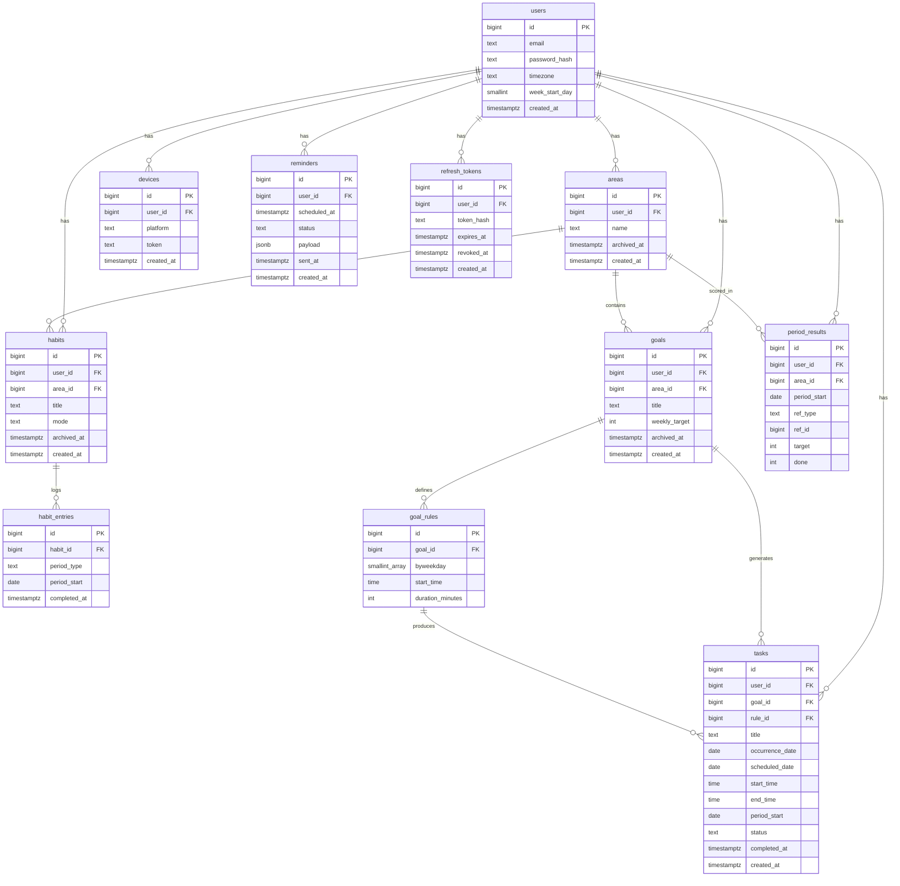

# Habit & Goal Tracking — Database Schema

## ER Diagram



## Tables

### users

| column | type | note |
|---|---|---|
| id | bigint | PK |
| email | text | unique |
| password_hash | text | |
| timezone | text | IANA, e.g. Europe/Istanbul |
| week_start_day | smallint | 1 = Monday |
| created_at | timestamptz | |

### refresh_tokens

| column | type | note |
|---|---|---|
| id | bigint | PK |
| user_id | bigint | FK -> users |
| token_hash | text | unique, sha256 of the token |
| expires_at | timestamptz | issued_at + 30 days |
| revoked_at | timestamptz | nullable |
| created_at | timestamptz | |

```sql
CREATE INDEX ON refresh_tokens (user_id) WHERE revoked_at IS NULL;
```

### areas

| column | type | note |
|---|---|---|
| id | bigint | PK |
| user_id | bigint | FK -> users |
| name | text | |
| archived_at | timestamptz | nullable |
| created_at | timestamptz | |

### habits

| column | type | note |
|---|---|---|
| id | bigint | PK |
| user_id | bigint | FK -> users |
| area_id | bigint | FK -> areas |
| title | text | |
| mode | text | DAILY \| WEEKLY |
| archived_at | timestamptz | nullable |
| created_at | timestamptz | |

### habit_entries

| column | type | note |
|---|---|---|
| id | bigint | PK |
| habit_id | bigint | FK -> habits |
| period_type | text | DAY \| WEEK |
| period_start | date | first day of the week when WEEK |
| completed_at | timestamptz | |

```sql
UNIQUE (habit_id, period_type, period_start)
```

### goals

| column | type | note |
|---|---|---|
| id | bigint | PK |
| user_id | bigint | FK -> users |
| area_id | bigint | FK -> areas |
| title | text | |
| weekly_target | int | nullable |
| archived_at | timestamptz | nullable |
| created_at | timestamptz | |

### goal_rules

| column | type | note |
|---|---|---|
| id | bigint | PK |
| goal_id | bigint | FK -> goals |
| byweekday | smallint[] | e.g. {1,3,5} |
| start_time | time | |
| duration_minutes | int | |

### tasks

| column | type | note |
|---|---|---|
| id | bigint | PK |
| user_id | bigint | FK -> users |
| goal_id | bigint | FK -> goals, nullable |
| rule_id | bigint | FK -> goal_rules, nullable |
| title | text | |
| occurrence_date | date | nullable, the date the rule produced |
| scheduled_date | date | |
| start_time | time | |
| end_time | time | start_time + duration_minutes |
| period_start | date | which week the quota counts toward |
| status | text | PENDING \| DONE \| DELETED |
| completed_at | timestamptz | nullable |
| created_at | timestamptz | |

```sql
CREATE UNIQUE INDEX ON tasks (goal_id, rule_id, occurrence_date)
WHERE occurrence_date IS NOT NULL;
```

### period_results

| column | type | note |
|---|---|---|
| id | bigint | PK |
| user_id | bigint | FK -> users |
| area_id | bigint | FK -> areas |
| period_start | date | |
| ref_type | text | HABIT \| GOAL |
| ref_id | bigint | habits.id or goals.id |
| target | int | |
| done | int | |

```sql
UNIQUE (ref_type, ref_id, period_start)
```

### reminders

| column | type | note |
|---|---|---|
| id | bigint | PK |
| user_id | bigint | FK -> users |
| scheduled_at | timestamptz | UTC, when to send |
| status | text | PENDING \| SENT \| CANCELLED |
| payload | jsonb | title, body, deep link, ref |
| sent_at | timestamptz | nullable |
| created_at | timestamptz | |

```sql
CREATE INDEX ON reminders (scheduled_at) WHERE status = 'PENDING';
```

### devices

| column | type | note |
|---|---|---|
| id | bigint | PK |
| user_id | bigint | FK -> users |
| platform | text | IOS \| ANDROID \| WEB |
| token | text | FCM / APNs device token |
| created_at | timestamptz | |

## Mechanics

### Auth

The access token is a JWT carrying `sub` and `exp`, valid 15 minutes. It is never stored; the signature is the only check.

The refresh token is a random string valid 30 days. Only its sha256 hash is stored. Login inserts a row; it does not touch existing rows, so several devices can hold live tokens at once.

`/auth/refresh` rotates: the presented row is read `FOR UPDATE`, marked `revoked_at`, and a new row is issued. Both tokens are returned. A row is accepted only when the hash matches, `revoked_at` is NULL and `now() < expires_at`; any failure returns 401 and the client goes back to login.

A presented token that is already revoked means a second holder exists, so every live row for that user is revoked and the request returns 401. The client serialises refreshes behind a single in-flight promise so parallel 401s do not trigger this.

`revoked_at` is also written on logout (that row) and on password change (every row for the user).

### Habit

A row is written only when the user checks off. `period_type` preserves the granularity of older rows even after `mode` changes.

### Task generation

Shared function: `materialize(user_id, from_date, to_date)`. Two triggers:

```
/today, /week request     ->  the requested week
Background worker         ->  the next 24 hours
   (every 5-15 min)
```

For each rule, check whether a `(rule_id, period_start)` row exists in `tasks`. If not, expand `byweekday` into dates and `INSERT ... ON CONFLICT DO NOTHING`.

`occurrence_date` holds the date the rule produced and never changes; the unique index prevents the same occurrence from being generated twice.

The worker derives the date from the user's `timezone`, not from the server's UTC date. Filter: users with notifications enabled and active in the last 30 days.

### Postpone

`scheduled_date` is updated. `occurrence_date` and `period_start` stay fixed.

### Delete

Soft delete (`status = DELETED`) when `occurrence_date` is set. Hard delete when it is NULL.

### Rollup

The open week is computed live. When the week closes, `target` and `done` are written to `period_results` and never recomputed.

Area result: every `period_results` row for that week satisfies `done >= target`.

### Notification

A `reminders` row is written when the task is created, `scheduled_at` = 5 minutes before the start, converted to UTC. Updated when the task is moved, `status = CANCELLED` when deleted.

The scheduler scans `status = 'PENDING' AND scheduled_at <= now()` every minute, sends to the `devices` tokens via FCM/APNs, then writes `status = SENT`.
